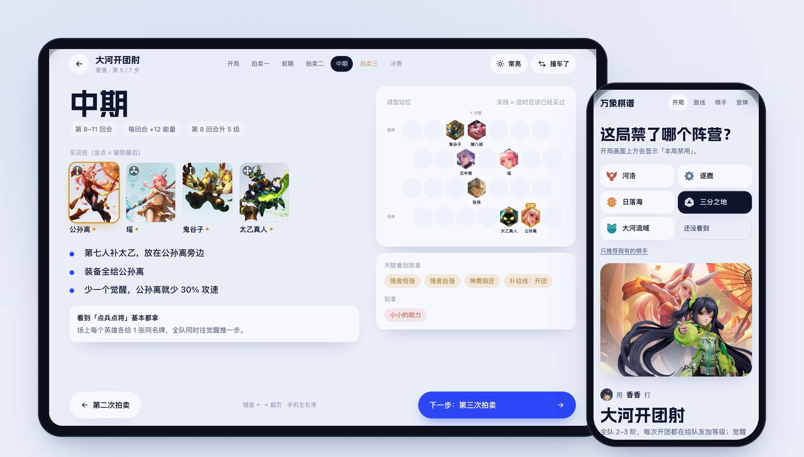
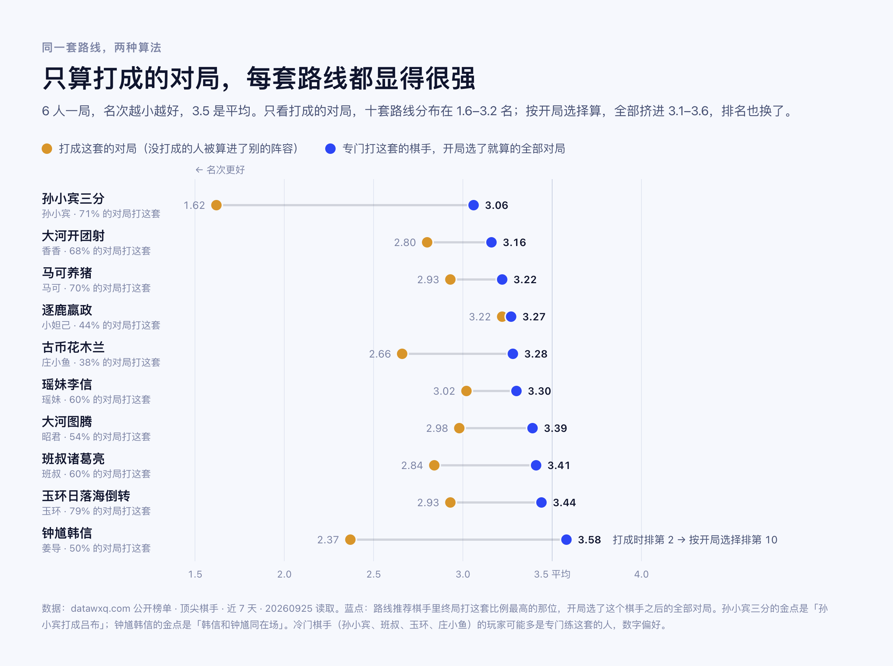
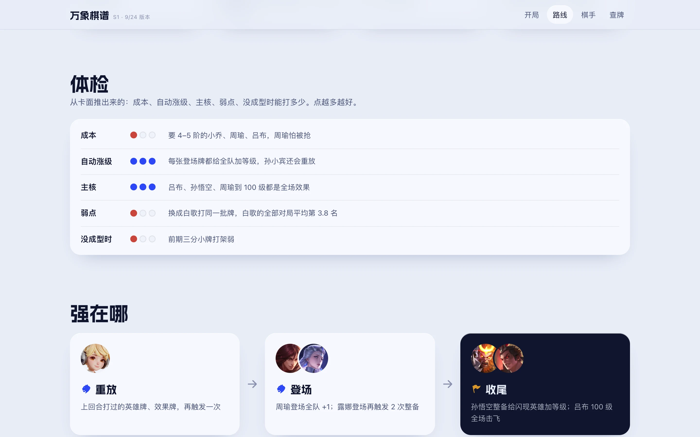
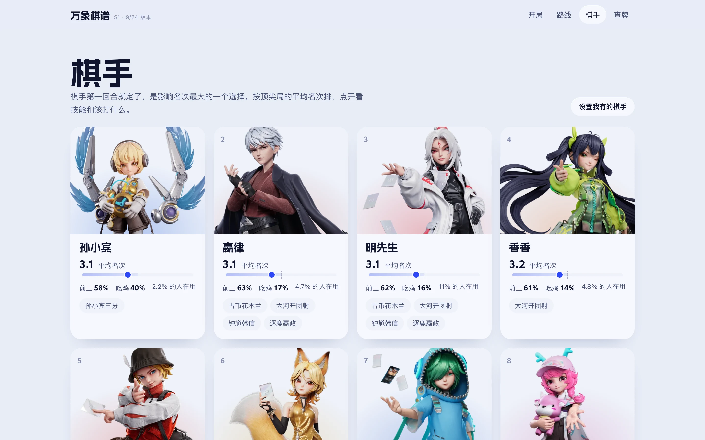
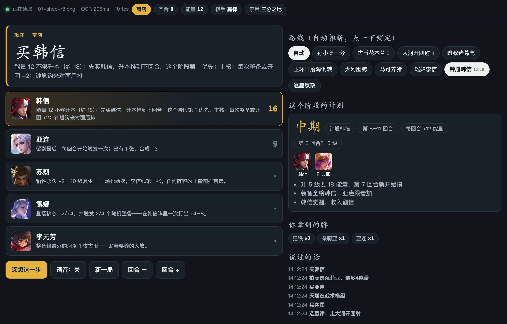
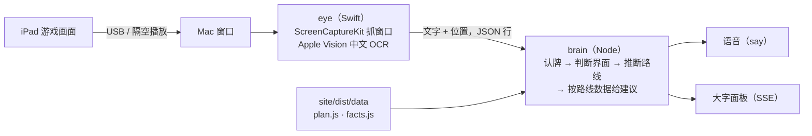
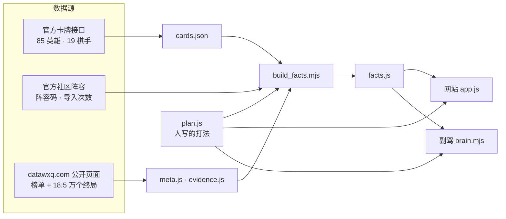

<div align="center">

<a href="https://wanxiang.52-198-144-26.sslip.io/">
<picture>
  <source media="(prefers-color-scheme: dark)" srcset="docs/images/banner-dark.webp">
  
</picture>
</a>

**王者万象棋 S1 对局助手**：开局按本局禁用的阵营给出棋手和路线，对局中逐阶段告诉你买什么、拍卖出多少、什么时候换。

[**在线使用 →**](https://wanxiang.52-198-144-26.sslip.io/)　·　[数据怎么来的](docs/methodology.md)　·　[局内副驾](copilot/README.md)　·　[更新日志](CHANGELOG.md)

[](https://wanxiang.52-198-144-26.sslip.io/)
[](CHANGELOG.md)
[](docs/methodology.md)
[](https://github.com/billpwchan/wanxiang-qipu/actions/workflows/verify.yml)
[](#本地运行)
[](LICENSE)

</div>

<p align="center">
  
</p>

## 怎么用

一局万象棋里真正要做决定的时刻只有几个，网站按这个顺序排：

1. **开局看禁用。** 画面上方会显示「本局禁用」。点一下对应阵营，得到用哪个棋手、打哪套路线，以及三条备选。只想看自己有的棋手，就在「只推荐我有的棋手」里勾选。
2. **对局放在旁边。** 点「开始对局」进入对局副屏：开局、三次拍卖、前期、中期、决赛共 7 步，每步列出要买的牌、拍卖出价上限、这时看到就拿的天赋。棋盘随阶段点亮已经该买到的位置。键盘 ← →、手机左右滑翻页，屏幕常亮。
3. **撞车了就换。** 前 4 回合发现有人和你凑同一个主核，点「撞车了」，看这套能转去哪条路线。

<picture>
  <source media="(prefers-color-scheme: dark)" srcset="docs/images/showcase-dark.webp">
  
</picture>

## 同一套路线，两种算法

阵容榜通常统计「终局阵容」：对局结束时场上是什么，就算哪一套。问题是没打成的人会被记到别的阵容里，每套路线都只剩下成功的样本。

棋手在第一回合就选定了。**「选了这个棋手之后的全部对局」**不受打没打成的影响，更接近你开局这么选之后的真实结果。万象棋谱每条路线的主数字，用的是专门打这套的棋手的全部对局。

<picture>
  <source media="(prefers-color-scheme: dark)" srcset="docs/images/chart-survivorship-dark.png">
  
</picture>

换成开局口径后有三处变化：

- **钟馗韩信从第 2 掉到第 10。** 打成时平均 2.37 名，但主打它的姜导全部对局是 3.58。韩信太脆，没打成的局很多。
- **十套路线的差距缩到约半个名次**（3.06–3.58）。同一批牌换个棋手，差距反而更大：三分登场用孙小宾是 3.1，用白歌是 3.8。所以先定棋手，再定路线。
- **便宜的路线更稳。** 大河开团射全队 2–3 阶、每场开战自动涨级，香香的对局 68% 在打它，全部对局平均 3.16。孙小宾三分的数字更好（3.06），但只有孙小宾能打。

口径、样本偏差和做不到的事，写在 [docs/methodology.md](docs/methodology.md)。

## 十套路线

按「棋手的全部对局」平均名次排序（6 人一局，第 1 名最好，3.5 是平均）。点名字打开路线页。

<!-- routes:start -->
| 路线 | 阵营 | 主核 | 棋手 | 平均名次<br><sub>棋手的全部对局</sub> | <sub>只算打成的对局</sub> | 档位 | 特点 |
|---|---|---|---|---|---|---|---|
| [孙小宾三分](https://wanxiang.52-198-144-26.sslip.io/#/r/lvbu) | 三分 | 吕布 | 孙小宾 | **3.06**（孙小宾） | 1.62 | 首选 | 上限最高，但离不开孙小宾 |
| [大河开团射](https://wanxiang.52-198-144-26.sslip.io/#/r/kaituan) | 大河 | 公孙离 | 香香、明先生、嬴律 | **3.16**（香香） | 2.80 | 首选 | 便宜、每场开战自动涨级 |
| [马可养猪](https://wanxiang.52-198-144-26.sslip.io/#/r/marco) | 无阵营 | 猪八戒 | 马可 | **3.22**（马可） | 2.93 | 可以打 | 全 3 阶最便宜，几乎没人抢 |
| [逐鹿嬴政](https://wanxiang.52-198-144-26.sslip.io/#/r/yingzheng) | 逐鹿 | 嬴政 | 明先生、小妲己、嬴律 | **3.27**（小妲己） | 3.22 | 可以打 | 飞剑强，但最容易撞车 |
| [古币花木兰](https://wanxiang.52-198-144-26.sslip.io/#/r/mulan) | 河洛 | 花木兰 | 嬴律、明先生、庄小鱼 | **3.28**（庄小鱼） | 2.66 | 可以打 | 有花木兰时很强，前期偏弱 |
| [瑶妹李信](https://wanxiang.52-198-144-26.sslip.io/#/r/lixin) | 河洛 | 李信 | 瑶妹、常小娥 | **3.30**（瑶妹） | 3.02 | 可以打 | 战斗里越死越强，怕被秒 |
| [大河图腾](https://wanxiang.52-198-144-26.sslip.io/#/r/totem) | 大河 | 敖隐 | 昭君、闹闹、瑶妹 | **3.39**（昭君） | 2.98 | 一般 | 要两张 5 阶 |
| [班叔诸葛亮](https://wanxiang.52-198-144-26.sslip.io/#/r/zhuge) | 三分 | 诸葛亮 | 班叔 | **3.41**（班叔） | 2.84 | 一般 | 全靠战斗里叠临时等级 |
| [玉环日落海倒转](https://wanxiang.52-198-144-26.sslip.io/#/r/yuhuan) | 日落海 | 司空震 | 玉环、小妲己 | **3.44**（玉环） | 2.93 | 一般 | 拿不到司空震就崩 |
| [钟馗韩信](https://wanxiang.52-198-144-26.sslip.io/#/r/hanxin) | 大河 | 韩信 | 明先生、姜导、嬴律 | **3.58**（姜导） | 2.37 | 一般 | 等级涨得最快，但韩信太脆 |
<!-- routes:end -->

## 热门但别打

这些阵容在游戏里被导入过几十万到上百万次，顶尖对局里打成了也排在 3.7 名以后。

<!-- traps:start -->
| 阵容 | 游戏内被导入 | 打成了也只有 | 棋手的全部对局 | 改成 |
|---|---|---|---|---|
| 白歌三分倒转 | 151 万次 | 3.74 | 白歌 3.78 | 同一批牌换孙小宾打。→ [孙小宾三分](https://wanxiang.52-198-144-26.sslip.io/#/r/lvbu) |
| 常小娥海陆空（四人） | 138 万次 | 3.99 | 常小娥 3.76 | 补上太乙、钟馗到六人；或者常小娥去打李信。→ [瑶妹李信](https://wanxiang.52-198-144-26.sslip.io/#/r/lixin) |
| 阿离百里守约 | 55 万次 | 3.71 | 阿离 3.90 | 阿离改打海月四人（海月、太乙、扁鹊、瑶）。 |
| 普通日落海（安琪拉、米莱狄） | 131 万次 | 3.80 | 闹闹 3.51 | 日落海底座接韩信，或者玉环倒转。→ [钟馗韩信](https://wanxiang.52-198-144-26.sslip.io/#/r/hanxin) |
| 镜 · 猪虎四人 | 26 万次 | 4.33 | 镜 3.73 | 镜也打复读吕布。→ [孙小宾三分](https://wanxiang.52-198-144-26.sslip.io/#/r/lvbu) |
<!-- traps:end -->

## 页面

<table>
<tr>
<td width="50%"><br><b>对局副屏</b>　7 个阶段逐步翻页；右侧棋盘实线 = 这时应该已经买到，拍卖页给出每张牌的出价上限。</td>
<td width="50%"><br><b>路线页</b>　主核原画上的竖纹玻璃；推荐棋手、平均名次、官方社区阵容码一键复制。</td>
</tr>
<tr>
<td><br><b>体检与机制链</b>　成本、自动涨级、主核、弱点、没成型时各打几分，以及这套「强在哪」的三步机制。</td>
<td><br><b>棋手</b>　19 位棋手按全部对局平均名次排序，官方 3D 立绘，点开看技能和该打哪套。</td>
</tr>
</table>

另有 **查牌**（85 英雄、98 效果牌、73 装备、258 天赋，官方卡面，可按阵营、品阶、效果文字搜）和 **通用规则**（8 条不管打哪套都适用的规则，对局副屏会在对应阶段提醒）。

## 万象副驾：不用打字的局内助手

对局里没空在网页上点来点去。副驾在 Mac 上读取 iPad 的镜像画面，自己认出选棋手、商店、天赋三选一和拍卖界面，用语音说「买韩信」「天赋选战术模组」「拍卖拿朵莉亚，最多 4 能量」，同时在 Mac 或手机上显示一块大字面板。





- **只看画面**：不读游戏内存、不抓网络包、不点击屏幕。全部在本机运行。
- **两路认牌**：卡名读不出来（比如被截成「典娜」）时，用卡牌效果文字匹配，每个英雄的效果文字都是唯一的。
- **和网站同一套判断**：路线、每阶段买法、拍卖上限都来自网站的 `plan.js` 和 `facts.js`。
- 需要 macOS 14+、屏幕录制权限。详见 [copilot/README.md](copilot/README.md)。腾讯没有公开允许第三方辅助工具，排位中使用有被判违规的可能，请自行判断。

## 技术上值得一看的

- **无构建、零依赖。** 原生 ES 模块，`index.html` + `app.js`（约 850 行，哈希路由）+ `glass.js`。站点 19 MB，其中 18 MB 是图片。没有 `npm install`。
- **竖纹玻璃是一个片元着色器。** 官方 S1 主视觉的竖纹玻璃，在 [`glass.js`](site/dist/glass.js) 里用 WebGL2 实现：每条竖纹是一段柱面透镜，横向折射 + RGB 分离色散 + 5 次采样磨砂 + 高光线，扫描线把玻璃「推开」露出答案。不支持 WebGL2 或系统开启「减少动态效果」时退回静态图。
- **打法和数字分开。** `plan.js` 是人写的打法（短句、没有统计数字），`facts.js` 由 [`build_facts.mjs`](scripts/build_facts.mjs) 从三份数据源生成。README 里的两张表也是脚本生成的，CI 会检查它们和数据一致。
- **测试不装 Puppeteer。** [`verify-ui.mjs`](scripts/verify-ui.mjs) 直接用 Chrome DevTools 协议跑 50 项真实浏览器交互，包括 4 种屏幕宽度 × 5 个页面无横向溢出；[`verify-site.mjs`](scripts/verify-site.mjs) 检查每张牌都在官方卡池里、每条路线 7 个阶段齐全、禁用推荐不会推荐被禁的路线。
- **部署**：只读容器、96 MiB 内存上限、每个文件带 SHA-256 清单、原子替换软链接切换版本，见 [docs/deployment.md](docs/deployment.md)。



架构细节见 [docs/architecture.md](docs/architecture.md)。

## 本地运行

需要 Python 3（静态服务器）。测试需要 Node 22+ 和 Chrome。

```sh
git clone https://github.com/billpwchan/wanxiang-qipu.git
cd wanxiang-qipu
npm run serve   # → http://127.0.0.1:4173/
npm test        # 数据完整性 + 50 项浏览器交互 + 副驾回放
```

副驾（macOS）：

```sh
./copilot/wx demo      # 不开游戏，用测试帧预览面板
./copilot/wx windows   # 列出可抓取的窗口
./copilot/wx           # 开始（默认抓 QuickTime「影片录制」窗口）
```

游戏版本更新后怎么重跑数据，见 [docs/data-pipeline.md](docs/data-pipeline.md)。

## 目录

```
site/dist/        网站（直接部署这个目录）
  app.js          页面与路由        glass.js   竖纹玻璃着色器
  data/plan.js    打法（人写）      facts.js   数字（生成）
copilot/          局内副驾：eye/（Swift 抓屏 + OCR）、brain.mjs、hud/、test/
scripts/          数据抓取、素材处理、测试、发布、README 配图
research/         原始数据快照、条件查询结果、机制假设与分析脚本（见 research/README.md）
deploy/           服务器安装、原子更新、校验脚本
docs/             方法、架构、数据流程、部署；images/ 与 src/ 是 README 配图及其源页面
```

## 路线图

- [x] 按禁用推荐棋手和路线；对局副屏；十套路线的体检、机制链、站位、7 阶段买法
- [x] 路线主数字改用「棋手的全部对局」
- [x] 副驾：选棋手 / 商店 / 天赋 / 拍卖四种界面，语音 + 面板
- [ ] 副驾：用真实对局截帧校准商店、手牌、能量的位置（欢迎提交 `--save` 截帧，见 [CONTRIBUTING.md](CONTRIBUTING.md)）
- [ ] 副驾：识别场上棋子（现在只读手牌）
- [ ] 拍卖出价上限和站位目前来自卡面机制推导，还没有对局数据验证
- [ ] 游戏每次版本更新后重跑数据并发布

每次重跑数据都会发一个 [Release](https://github.com/billpwchan/wanxiang-qipu/releases)。点右上角 **Watch → Custom → Releases**，版本更新后会收到通知。

## 参与

数据不对、游戏版本更新了、副驾认错牌，都欢迎开 [Issue](https://github.com/billpwchan/wanxiang-qipu/issues/new/choose)，模板会问需要的信息。改代码或打法之前请看 [CONTRIBUTING.md](CONTRIBUTING.md)。

## 数据来源

| 来源 | 用在 |
|---|---|
| 官方卡牌接口快照（`research/raw-20260925/`，9/24 版本） | 卡面规则、机制推导、查牌 |
| 官方社区阵容接口 | 阵容码、导入次数 |
| [datawxq.com](https://www.datawxq.com/) 公开榜单（顶尖棋手、近 7 天） | 棋手与阵容的平均名次、按禁用的表现 |
| datawxq 大数据检索器（v260924、近 7 天、184,680 个终局，150+ 次条件查询） | 搭档、撞车、棋手 × 主核、天赋与出装 |
| 王者荣耀官网皮肤原画 | 路线页海报 |
| [阿里妈妈数黑体](https://www.npmjs.com/package/@fontpkg/alimama-shu-hei-ti) | 标题字体（免费商用，按站内文字子集化） |

## 声明

非官方玩家研究项目，与腾讯、王者荣耀无关。游戏名称、卡面、立绘、原画等素材版权归腾讯所有；对局统计来自 datawxq.com 的公开页面。代码以 [MIT](LICENSE) 许可发布，许可范围不包括上述游戏素材和第三方数据。

<div align="center">

[](https://star-history.com/#billpwchan/wanxiang-qipu&Date)

</div>
