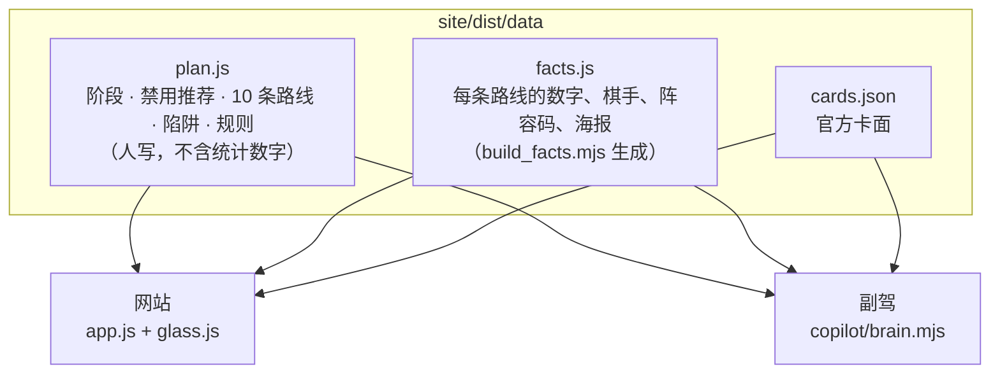
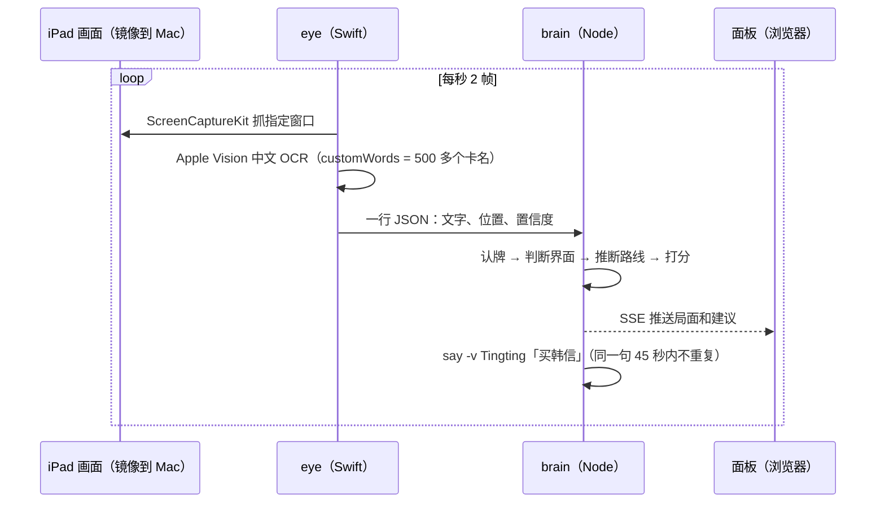

# 架构

两个产品共用一份判断数据：



## 网站（`site/dist/`）

没有构建步骤。浏览器直接加载 `index.html` → `app.js`（ES 模块）→ `data/*.js`。部署时把整个 `site/dist/` 拷到服务器即可。

### 页面与路由

哈希路由，`render()` 根据 `location.hash` 生成整页 HTML 字符串（所有插值经过 `esc()` 转义），再挂上各页的 `mount`（画 WebGL、填查牌结果）。

| 地址 | 页面 | 说明 |
|---|---|---|
| `#/?ban=河洛` | 开局 | 禁用阵营写进地址，可以直接分享 |
| `#/play/<路线>?lord=<棋手>&s=<步>` | 对局副屏 | 进度存在 `localStorage`，刷新后接着上次 |
| `#/r/<路线>` | 路线页 | 旧地址 `#/route/<路线>` 会跳转过来 |
| `#/routes` · `#/lords` · `#/cards` · `#/rules` | 路线列表 · 棋手 · 查牌 · 通用规则 | |

卡牌、棋手详情、数据说明、「我有的棋手」都在同一个 `<dialog>` 抽屉里打开。

### 状态

只有两样，都在 `localStorage`，键名前缀 `wx.`：

- `wx.owned`：「我有的棋手」。开局推荐只从这些棋手里选。
- `wx.play.<路线>`：对局副屏停在第几步。

读写都包在 `try/catch` 里，隐私模式下存不了也能正常用。

### 数据分层

`plan.js` 只写玩家在对局里要看的东西：短句、动词开头、用游戏里的叫法，不写统计数字。数字全部由 `scripts/build_facts.mjs` 从 `meta.js`（榜单）、`evidence.js`（检索器）、`lineups.json`（社区阵容）计算后写进 `facts.js`，标注「勿手改」。这样改打法不会碰到数字，重跑数据也不会覆盖打法。

`verify-site.mjs` 会检查两边对得上：`plan.js` 里的每张牌、天赋、装备都在官方卡池里；每条路线 7 个阶段齐全；成型阵容里的每个人都在某个阶段的购买或拍卖里出现过；禁用推荐不会推荐打不了的路线；页面文案里没有「双重差分」「幸存者偏差」这类统计术语。

### 竖纹玻璃（`glass.js`）

官方 S1 主视觉是一块竖纹玻璃。`Glass` 类用 WebGL2 画一个全屏四边形，两张纹理：

- **A**：玻璃后面的画面（开局页是一排棋手立绘，可以无缝横向滚动）；
- **B**：玻璃推开后清晰显示的画面（答案：路线原画 + 棋手立绘，由 `composeAnswer` 在离屏 canvas 里合成）。

片元着色器里，每条竖纹是一段柱面透镜：

```glsl
float fx = uv.x * flutes + ptr.x * .8 + t * .02;   // 竖纹编号随指针和时间微动
float lens = (fract(fx) - .5);
lens = lens * (1. + .35 * lens * lens * 4.);          // 边缘折射更强
// 横向 5 次采样 = 磨砂；R/G/B 各自偏移 = 色散
col.r += sa(uv + off * (1. + d * 9.) + vec2(kk, 0.)).r;
col.g += sa(uv + off + vec2(kk, 0.)).g;
col.b += sa(uv + off * (1. - d * 9.) + vec2(kk, 0.)).b;
```

`open` 从 0 推到 1 时，一条扫描线从左往右把玻璃推开，扫描线前沿带一点液态折射。路线页用 `edge` 模式：左半边固定是玻璃（标题压在上面），右半边清晰。

性能与降级：

- 画布不可见或标签页隐藏时停掉 `requestAnimationFrame`；
- 设备像素比封顶 1.5；拼接的纹理宽度控制在 4096 以内（iPad 的安全上限）；
- 不支持 WebGL2 → 显示静态立绘；系统开启「减少动态效果」或地址带 `?still` → 不做动画，直接显示结果（测试也用这个）。

### 对局副屏的细节

- 屏幕常亮用 Wake Lock API；切回页面时系统会释放锁，页面自动重新申请。
- 翻页：键盘 ← → 和空格、手机左右滑（横向位移 >70px 且明显大于纵向）。
- 棋盘是 7 列 × 4 行的错位六边形 SVG，和游戏里的站位图一致；当前阶段之前该买的位置是实线，这一步新买的高亮，还没买的是虚影。

## 副驾（`copilot/`）



### eye（`copilot/eye/main.swift`）

一个命令行程序，三个子命令：`list` 列出可抓的窗口；`watch --match <窗口名> --fps 2 [--save 目录]` 持续抓屏识别，每帧输出一行 JSON；`ocr <图片…>` 识别图片文件（测试用）。需要 macOS 14+（`SCScreenshotManager`）和屏幕录制权限。`./copilot/wx` 在源码比二进制新时自动重新编译。

### brain（`copilot/brain.mjs`）

三种模式：`live`（接 eye）、`replay <frames.jsonl>`（回放，打印每帧的判断）、`demo <frames.jsonl> [--every ms] [--until N]`（不开游戏预览面板）。

1. **认牌。** 先按卡名精确匹配；≥3 字的名字允许错 1 个字（只接受唯一候选）；被截断的名字（「典娜」）在 ≥3 字的英雄名里找唯一的前缀/后缀。名字读不出来时，用卡牌效果文字的二元组和每个英雄的效果文字比对（命中率 ≥60% 且领先第二名 ≥20%）。
2. **判断界面。** ≥2 个棋手名 → 选棋手；出现「竞拍 / 出价 / 拍卖」→ 拍卖；≥2 个天赋名且英雄 ≤1 → 天赋三选一；有英雄 → 商店。商店区、手牌区默认按画面高度划分，可以用 `copilot/layout.json` 校准。
3. **推断路线。** 手牌里每新出现一个英雄，记为拿到一张。每条路线按「主核 4 分、成型阵容 3 分、出现在某阶段买法或拍卖里各 0.4 分」给已拿到的牌打分，加上棋手（路线首选棋手 +3，其他推荐棋手 +2，选棋手时推荐的路线再 +2）。本局禁用的阵营打不了的路线直接排除。面板上点一下可以锁定路线。
4. **给建议。** 阶段按回合换算（1–3 开局、4–7 前期、8–11 中期、12+ 决赛，拍卖按第几次）。商店的牌按「这个阶段第几优先 / 下个阶段要买 / 在成型阵容里 / 已有几张（合成、觉醒） / 能转去别的路线」打分；升本回合会提醒能量够不够。天赋按路线的必拿 / 可以拿 / 别拿排序，前两次升本给能量类天赋加分。拍卖按路线的出价上限。选棋手和网站开局推荐的顺序一致。
5. **深想（可选）。** 面板上的「深想这一步」把文字局面发给本机 `claude` 命令做第二意见，系统提示里写明万象棋的规则（没有星级、利息、连胜），只发送文字。

面板接口：`GET /events`（SSE）、`GET /routes`、`POST /pin?route=`、`/voice?on=`、`/round?r=`、`/lord?name=`、`/ban?f=`、`/reset`、`/deep`。默认只监听 127.0.0.1；`--lan` 才对局域网开放（没有鉴权，只在自己的网络里用）。

## 测试

| 命令 | 检查什么 | 需要 |
|---|---|---|
| `node scripts/verify-site.mjs` | 数据完整性：卡牌引用、阶段、站位、禁用推荐、图片文件、文案用词 | Node |
| `node scripts/verify-ui.mjs [地址]` | 50 项真实浏览器交互；不给地址时自带静态服务器测 `site/dist` | Node 22+、Chrome |
| `GPU=1 node scripts/verify-ui.mjs` | 额外检查玻璃画布真的在画 | 同上 |
| `node copilot/test/run.mjs` | 用官方卡面合成 8 张模拟画面 → Chrome 截图 → Vision OCR → brain 回放 → 检查每步建议 | macOS、Chrome |
| `node copilot/test/run.mjs --replay` | 只回放已提交的 OCR 结果 | Node |
| `node scripts/sync_readme.mjs --check` | README 的两张表和数据一致 | Node |

CI（`.github/workflows/verify.yml`）在 Ubuntu 上跑数据完整性、浏览器交互（装了中文字体，横向溢出检查依赖真实字宽）、副驾回放和 README 同步检查。

## 部署

静态文件放在只读容器里，由共享网关反向代理。更新是上传新版本目录 → 核对每个文件的 SHA-256 → 原子替换 `current` 软链接，不重启容器、不重载网关。详见 [deployment.md](deployment.md)。
