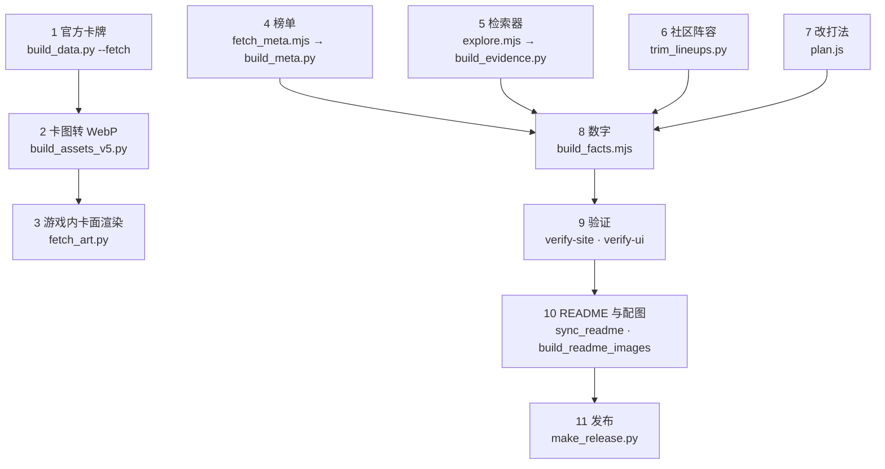

# 更新数据

游戏更新后，按这个顺序重跑。每一步的输入、输出都写在下面；不需要的步骤可以跳过（比如只换了平衡数值，就不用重做素材）。



## 准备

```sh
pip3 install -r requirements.txt     # Pillow、numpy、opencv-python、fonttools
brew install potrace                 # 阵营 / 关键词图标矢量化（build_assets_v5.py）
```

还需要 Node 22+ 和 Google Chrome（抓 datawxq 页面、测试、截图都通过 Chrome DevTools 协议，不装 Puppeteer）。Chrome 不在默认位置时设 `CHROME=<路径>`。

## 1. 官方卡牌

```sh
python3 scripts/build_data.py --fetch
```

- 从官方卡牌接口下载 5 个端点（英雄、效果、装备、天赋、棋手）到 `research/raw-<今天>/`，生成 `site/dist/data/cards.json`。
- 卡面图片按 URL 的 SHA-256 命名，缓存在 `research/cache/cards/`（不进仓库、不上线），已存在的不重复下载。
- 不加 `--fetch` 时用 `research/raw-20260925/` 的快照重建。

## 2. 卡图转 WebP、棋手立绘、图标

```sh
python3 scripts/build_assets_v5.py
```

- `research/cache/cards/*.png` → `site/dist/assets/c/*.webp`，并把 `cards.json` 里的图片路径改成 WebP。**第 1 步之后必须跑这一步**，否则 `cards.json` 指向不存在的 PNG。
- `research/v4/official/lord/` 的官方棋手 3D 立绘 → `site/dist/assets/lord/`（大图、小图、头像）+ `data/lords.json`。
- `research/v4/official/icon/` 的阵营 / 关键词图标 → potrace 矢量化 → `data/icons.js`。

## 3. 游戏内卡面渲染

```sh
python3 scripts/fetch_art.py
```

下载官方「游戏内卡面渲染」，缩放存为 `site/dist/assets/art/*.webp`，写 `data/art.json`。查牌抽屉里的大卡面用这个。

## 4. 榜单

```sh
node scripts/fetch_meta.mjs    # 约 3 分钟 → research/v2/datawxq-<今天>/
python3 scripts/build_meta.py  # 取最新一次抓取 → site/dist/data/meta.js
```

用无头 Chrome 像普通访客一样浏览 datawxq.com 的棋手榜和阵容榜（全部 + 每个禁用阵营），不调用网站的签名接口。

## 5. 检索器

```sh
node scripts/explore.mjs research/v2/explore/q-heroes.json research/v2/explore/r-heroes.json   # 约 50 分钟
# 另有 q-lords、q-combos、q-combos2、q-contest 四组查询
python3 research/v3/build_evidence.py   # → site/dist/data/evidence.js
python3 research/v3/deep.py             # 分析报告 → research/v3/deep-report.txt（可选）
```

`q-*.json` 是查询清单：每条写明「必须有」「不能有」的卡和要读的标签页。`scripts/explore-probe.mjs` 用来探查检索器页面结构变了没有。

## 6. 社区阵容

社区阵容的原始分页（`research/v4/lineups/p*.js`）和合并结果（`all.json`）含作者昵称、用户 ID 和头像，只留在本地。

```sh
python3 scripts/trim_lineups.py   # all.json → lineups.json（只留阵容码、名字、英雄、棋手、导入次数）
```

## 7. 改打法

打法在 `site/dist/data/plan.js`：阶段、禁用推荐、10 条路线（体检、机制链、站位、每阶段买法、天赋、转型）、陷阱、通用规则。写作规则写在文件开头：短句、动词开头、用游戏里的叫法，不写统计数字。

先写机制假设和可证伪的预测，再查数据（见 `research/v3/hypotheses.md`）。

## 8. 数字

```sh
node scripts/build_facts.mjs
```

把 `plan.js` 的路线和 `meta.js`、`evidence.js`、`lineups.json` 对齐，生成 `facts.js`。控制台会打印每条路线的档位、主数字、「打成」数字、阵容码和搭档，改完打法先看一眼这里。路线 id 和榜单阵容家族的对应关系在脚本顶部的 `FAMILY`。

## 9. 验证

```sh
node scripts/verify-site.mjs
node scripts/verify-ui.mjs
GPU=1 node scripts/verify-ui.mjs   # 可选：检查玻璃真的在画
node copilot/test/run.mjs          # macOS：副驾完整流程
```

`verify-ui.mjs` 里有几项断言写了具体结果（比如禁三分 → 香香 · 大河开团射、孙小宾三分 3.1），数据变了要一起更新。

## 10. README 与配图

```sh
node scripts/sync_readme.mjs              # 重写 README 的「十套路线」「热门但别打」两张表
node scripts/build_readme_images.mjs      # 重做 docs/images/ 的横幅、设备展示、数据图、截图、副驾面板、动图
```

配图的源页面在 `docs/src/`，直接读 `site/dist` 的数据和素材。

## 11. 发布

```sh
python3 scripts/make_release.py   # 写 site/dist/release.json（每个文件的 SHA-256），打包到 releases/
```

上传和切换见 [deployment.md](deployment.md)。在 `CHANGELOG.md` 记一笔，并在 GitHub 发一个 Release，关注了 Releases 的人会收到通知。

## 可选：素材

```sh
python3 scripts/fetch_skins.py [英雄 …]           # 路线主核：官网皮肤原画 → SIFT 匹配卡面所用皮肤 → Vision 抠图 → 海报
python3 scripts/fetch_skins.py --cut-only 张良 瑶  # 只要紧裁切
python3 scripts/cut_focus.py                      # 抠图的脸部焦点
python3 scripts/build_font.py                     # 标题字体按站内文字子集化
python3 scripts/build_og.py                       # 分享卡片 assets/og.jpg
```

- `fetch_skins.py` 需要先编译抠图工具：`swiftc -O -parse-as-library scripts/lift/main.swift -o scripts/lift/lift`（macOS，Apple Vision）。原画缓存在 `research/skins/`。
- `build_font.py`、`build_og.py` 需要阿里妈妈数黑体原文件：

  ```sh
  mkdir -p research/v4/fonts/alimama-shu-hei-ti-1.0.5
  curl -sL "$(npm view @fontpkg/alimama-shu-hei-ti@1.0.5 dist.tarball)" | tar -xz -C research/v4/fonts/alimama-shu-hei-ti-1.0.5 --strip-components=1
  ```
